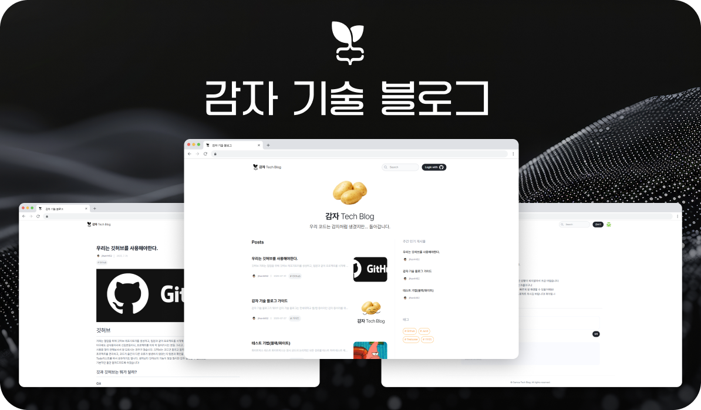
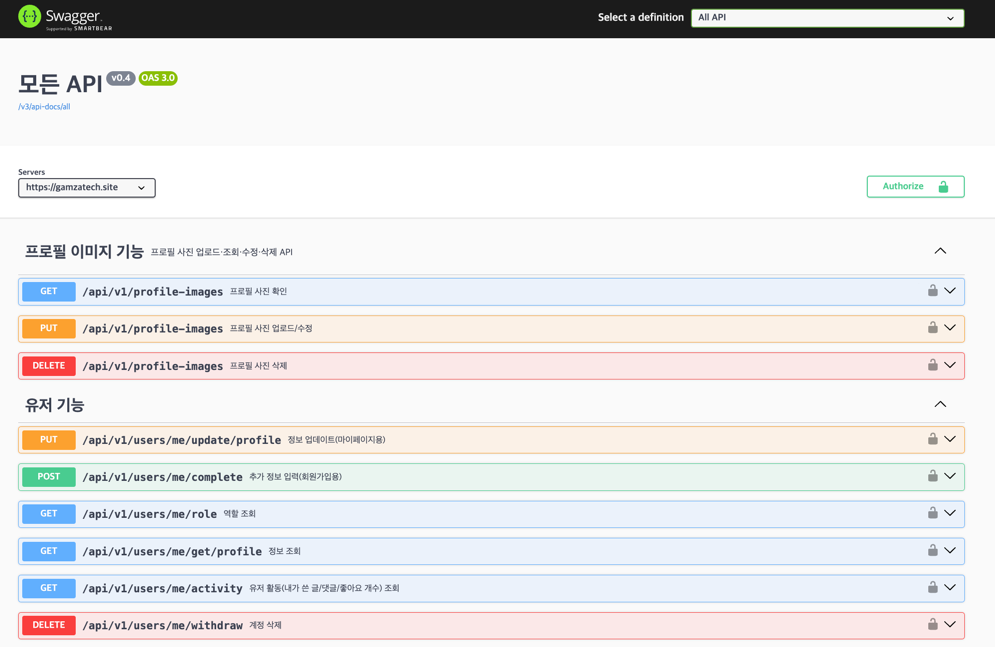
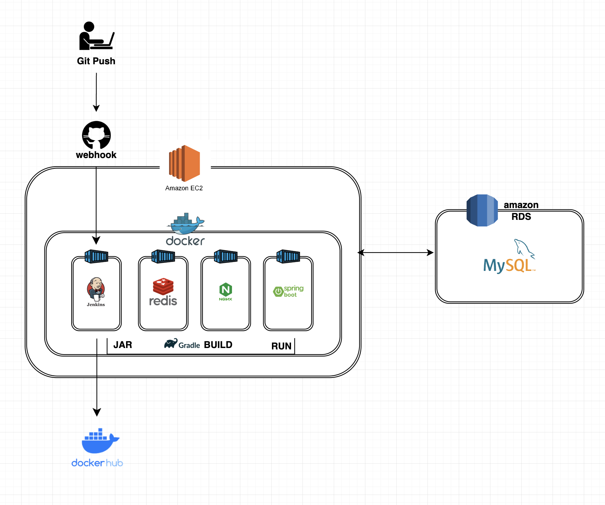
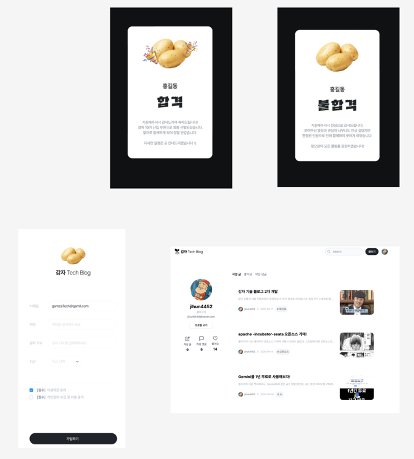
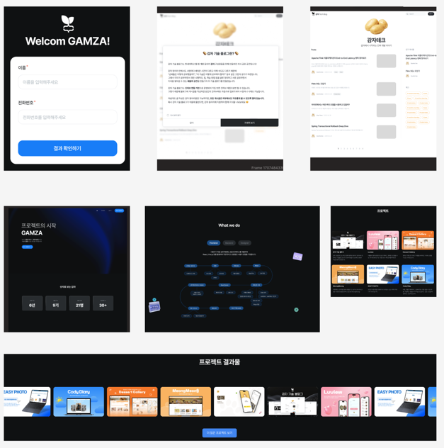
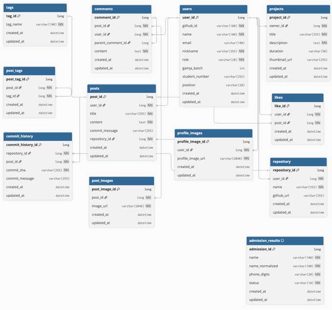

# 🥔 GamzaTechBlog (감자테크 블로그)

> 동아리 구성원들이 **개발 지식**과 **프로젝트 경험**을 공유하는 기술 블로그 플랫폼.  
> 글은 **개인 GitHub 저장소와 자동 동기화**되어 포트폴리오 자산으로 축적됩니다.

- [홍보 사이트](https://www.gamzatech.site/)
- [블로그](https://app.gamzatech.site/)
- [Swagger](https://gamzatech.site/swagger-ui/index.html)

---

## TL;DR

- **동아리 전용** 가입 → GitHub OAuth → **JWT(Access) + Redis(Refresh)**
- 글/프로젝트/댓글 **작성·수정·삭제**
- 글은 **개인 GitHub 레포지토리(.md)** 로 **자동 커밋/버전관리**
- 댓글/대댓글, 구성원 프로필, 프로젝트 소개
- (WIP) **AI 코드 품질 피드백**

---

## 주요 기능

### 1) 회원 & 인증

- 동아리 소속만 회원가입(관리자 승인)
- GitHub OAuth 로그인(필요 최소 범위: name, email, repo 등)
- JWT 발급, **Refresh Token은 Redis에서 관리**(만료/블랙리스트)

### 2) 게시물(Post)

- 마크다운 기반 작성/미리보기
- 생성/수정/삭제 시 **개인 GitHub 레포지토리에 자동 반영**
- 태그별 디렉토리 구조 & 일관된 파일 네이밍(`{postId}-{title}.md`)
- 커밋 메시지 규칙 예시
    - `Add: [Java] 감자란 무엇인가`
    - `Update: [JS] JS 이벤트 핸들링`
    - `Delete: [Java] 감자 구조 이해하기`

### 3) GitHub 동기화 정책

- 첫 게시물 작성 시 **개인 레포 자동 생성**(동아리 전용 네임스페이스/디렉토리)
- 앱 → GitHub **단방향 동기화**(현재)
- (로드맵) GitHub에서 직접 수정된 .md를 **역동기화(양방향)**

예시 디렉토리 구조:

- /감자/
    - Java/
        - 001-감자란.md
        - 005-개발환경.md
    - JS/
        - 003-JS기초.md

### 4) 댓글(Comments)

- 댓글/대댓글(무제한 깊이)
- 작성·수정·삭제, (옵션) 신고/모더레이션

### 5) 구성원(Profiles)

- 닉네임/기수/전공/한 줄 소개/소셜 링크
- (로드맵) 개인 GitHub 커밋 수, 활동 통계 시각화

### 6) 프로젝트(Projects)

- 구성원 프로젝트 문서화(주요 기능, 사용 기술, 인원, 기간)
- 마크다운 작성 & GitHub 레포 링크 연계

### 7) AI 코드 품질 피드백 (WIP)

- 게시글 내 코드 블록 자동 분석 → **간단 정적 피드백**
- (로드맵) 보안/성능 룰 확장, 리팩터링 제안

---

## 시스템 개요(텍스트 다이어그램)

사용자 → GamzaTechBlog API → (1) Auth/JWT/Redis  
↘ (2) DB 저장  
↘ (3) Git Sync Service → GitHub

핵심 포인트

- **인증**: GitHub OAuth + JWT + Redis Refresh
- **동기화**: 앱 트랜잭션 이후 GitHub 커밋으로 게시글 버전 관리
- **확장성**: Sync/Comment/Profile/Project 도메인 모듈화

---

## API 스냅샷(개요)

> 상세 스펙은 Swagger UI/문서 참고
>
> 

- Auth: `POST /auth/signup`(관리자 승인), `POST /auth/login`, `POST /auth/refresh`, `POST /auth/logout`
- Posts: `GET /posts`, `POST /posts`, `PATCH /posts/{id}`, `DELETE /posts/{id}`
- Comments: `POST /posts/{id}/comments`, `POST /comments/{id}/replies`, `PATCH/DELETE`
- Members: `GET /members/{id}`, `PATCH /members/{id}`
- Projects: `POST /projects`, `GET /projects`

---

## 비기능 요구사항(NFR)

### 보안

- 입력 검증(Bean Validation), 공통 예외 응답 포맷
- JWT 만료/재발급 플로우, Redis 블랙리스트
- (옵션) Rate limiting, CORS 정책 명시

### 신뢰성/일관성

- GitHub 동기화 실패 시 **재시도/보상 처리**(큐/스케줄러)

### 관측성

- 표준 로그 포맷 + 요청 상관관계 ID(Correlation-ID)
- (로드맵) Micrometer 메트릭 + Grafana 대시보드

### 성능

- 캐싱(태그/목록), 페이지네이션, N+1 방지 전략

---

## 기술 스택

- **Backend**: Java 21, Spring Boot 3.x, Spring MVC, Spring Data JPA
- **Auth**: GitHub OAuth, JWT, Redis(Refresh Token)
- **Infra**: MySQL(or PostgreSQL), Redis
- **Build/IDE**: Gradle, IntelliJ IDEA
- **DevOps**: Docker, (팀 내부) Jenkins/GitHub Actions

---

## 운영 & 협업 원칙

- 코드 스타일: **네이버 Java 컨벤션** 준수
- Git 전략: 기능 단위 브랜치 + 이슈 기반 협업
- 커뮤니케이션: Slack
- 리뷰: **주 1회 정기 코드 리뷰 & 회고**

---

## 서버 구성도

---

## 디자인

[피그마 디자인](https://www.figma.com/design/of5OcgQXWW3gnDLtVNz3Yk/Untitled?node-id=0-1&p=f&t=Q0LQnmoAtvx4tU5i-0)

---

## ERD

---

## FAQ

Q. 동아리 외 이용 가능한가요?  
A. 현재는 **관리자 승인 기반**의 내부 플랫폼입니다. (공개 전환 논의 중)

Q. GitHub 권한 범위는 어떻게 되나요?  
A. 필요한 최소 범위만 요청하며, 개인 레포 **생성/커밋**에 필요한 권한만 사용합니다.

Q. GitHub 커밋이 실패하면 글은 사라지나요?  
A. 아니요. 먼저 DB에 안전하게 저장되며, 이후 GitHub 동기화는 **재시도/보상 플로우**로 처리됩니다.

---

## 기여(Contributing)

- 이슈/PR 템플릿을 사용해 주세요.
- 코드 변경 시 간단한 테스트/문서 업데이트를 함께 부탁드립니다.

